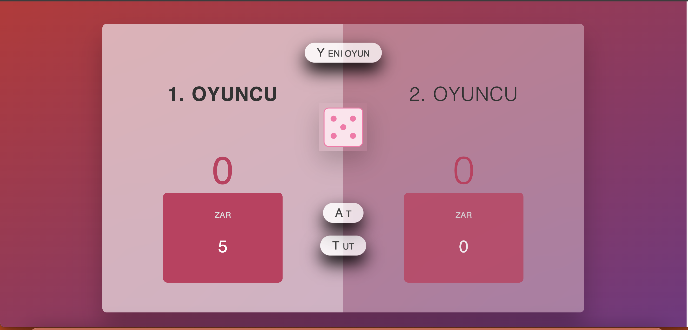

# Zar Oyunu
Bu proje, iki oyunculu bir zar oyunu uygulamasıdır. Oyuncular sırayla zar atarak puan biriktirir. İlk oyuncu 100 puana ulaşan kazanır. Ancak, oyuncu zar atarken "1" gelirse, o turdaki puanı sıfırlanır ve sıra diğer oyuncuya geçer. Oyun sırasında oyuncular puanlarını tutabilir veya sıfırlama riskini göze alarak zar atmaya devam edebilir.

## Özellikler
- 2 Oyunculu Oyun: Her iki oyuncu sırayla zar atar.
- Puan Toplama: Oyuncular her zar attığında çıkan sayı kadar puan kazanır.
- Puan Tutma: Oyuncular diledikleri zaman puanlarını tutup sırayı diğer oyuncuya geçirebilir.
- Zar Gelmezse Sıfırlama: Eğer zar "1" gelirse, oyuncunun o turdaki puanı sıfırlanır ve sıra rakibe geçer.
- Kazanan: 100 puana ulaşan ilk oyuncu oyunu kazanır.

### Ekran Görüntüsü

